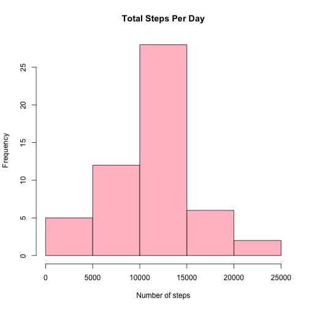
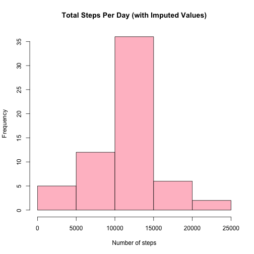

# Reproducible Research: Peer Assessment 1


## Loading and preprocessing steps

```r
# Load required libraries
library(xtable)

# Unzip the data file
unzip("activity.zip")

# Read the data set into R
data <- read.csv("activity.csv", colClasses = c("numeric", "Date", "numeric"))

# Disable scientific notation
options(scipen = 999, digits = 8)

# Set plotting to single panel
par(mfrow = c(1, 1))
```


## What is mean total number of steps taken per day?

```r
# Calculate the total number of steps per day
total.daily.steps <- tapply(data$steps, data$date, sum)

# Make a histogram of the total number of steps taken each day
hist(total.daily.steps, main = "Total Steps Per Day", xlab = "Number of steps", 
    col = "pink")
```

 

```r

# Calculate summary statistics for total steps per day
summary.stats <- summary(total.daily.steps)
mean.daily.steps <- summary.stats["Mean"]
median.daily.steps <- summary.stats["Median"]

# Print the summary statistics for total steps per day
print(summary.stats)
```

```
##    Min. 1st Qu.  Median    Mean 3rd Qu.    Max.    NA's 
##      41    8841   10765   10766   13294   21194       8
```


The mean total steps per day is **10766**.  
The median total steps per day is **10765**.

## What is the average daily activity pattern?


```r
# Calculate the average steps (across all days) for each interval
mean.per.interval.steps <- tapply(data$steps, data$interval, function(x) mean(x, 
    na.rm = T))

# Make a time series plot (i.e. type = 'l') of the 5-minute interval
# (x-axis) and the average number of steps taken, averaged across all days
# (y-axis)
x.axis.range <- 1:length(mean.per.interval.steps)
plot(as.integer(x.axis.range), mean.per.interval.steps, type = "l", main = "Average Steps Per Interval", 
    xlab = "Interval", ylab = "Number of steps", xaxt = "n")
axis(1, at = x.axis.range, names(mean.per.interval.steps))
```

 

```r

# Find which 5-minute interval, on average across all the days in the
# dataset, contains the maximum number of steps?
max.mean <- max(mean.per.interval.steps)
highest.average <- mean.per.interval.steps[mean.per.interval.steps == max.mean]

summary(mean.per.interval.steps)
```

```
##     Min.  1st Qu.   Median     Mean  3rd Qu.     Max. 
##   0.0000   2.4858  34.1130  37.3830  52.8350 206.1700
```


The 5-minute interval with the highest number of steps on average is 
**835**.   
It has an average of **206** steps.

## Imputing missing values


```r
# Calculate and report the total number of missing values in the dataset
# (i.e. the total number of rows with NAs)
missing.count <- sum(!complete.cases(data))
```


The total number of rows with missing values is **2304**.  

**Imputation method used:**  
Missing step values in an interval were filled-in with the mean number of
steps for that specific (5-minute) interval.


```r
# Fill-in missing data with the mean for the 5-minute interval.  Create a
# new dataset that is equal to the original dataset but with the missing
# data filled in.
filled.in.data <- data
for (i in 1:nrow(data)) {
    if (is.na(data$steps[i])) {
        filled.in.data$steps[i] <- mean.per.interval.steps[as.character(data$interval[i])]
    }
}

# Make a histogram of the total number of steps taken each day.
new.total.daily.steps <- tapply(filled.in.data$steps, filled.in.data$date, sum)
hist(new.total.daily.steps, main = "Total Steps Per Day (with Imputed Values)", 
    xlab = "Number of steps", col = "pink")
```

 

```r

# Calculate and report the mean and median total number of steps taken per
# day.
new.summary.stats <- summary(new.total.daily.steps)
new.mean.daily.steps <- new.summary.stats["Mean"]
new.median.daily.steps <- new.summary.stats["Median"]

# Print the summary statistics for total steps per day
print(new.summary.stats)
```

```
##    Min. 1st Qu.  Median    Mean 3rd Qu.    Max. 
##      41    9819   10766   10766   12811   21194
```


The mean total steps per day is **10766**.  
The median total steps per day is **10766**.  


```r
# Create a data frame to hold the summaries of the original data set and the
# filled-in data set
cmp.df <- data.frame(rbind(summary.stats[1:6], new.summary.stats), row.names = c("Original", 
    "Filled-in (imputed)"))
cmp.df[, names(summary.stats[7])] <- c(summary.stats[7], sum(!complete.cases(filled.in.data)))
names(cmp.df) <- names(summary.stats)
# Use xtable to make a pretty display
cmp.table <- xtable(cmp.df, display = c("s", "d", "d", "d", "d", "d", "d", "d"), 
    caption = "Total Steps Per Day Summary")
print(cmp.table, type = "html", caption.placement = "top")
```

<!-- html table generated in R 3.0.3 by xtable 1.7-3 package -->
<!-- Sat May 17 07:11:58 2014 -->
<TABLE border=1>
<CAPTION ALIGN="top"> Total Steps Per Day Summary </CAPTION>
<TR> <TH>  </TH> <TH> Min. </TH> <TH> 1st Qu. </TH> <TH> Median </TH> <TH> Mean </TH> <TH> 3rd Qu. </TH> <TH> Max. </TH> <TH> NA's </TH>  </TR>
  <TR> <TD align="right"> Original </TD> <TD align="right">  41 </TD> <TD align="right"> 8841 </TD> <TD align="right"> 10765 </TD> <TD align="right"> 10766 </TD> <TD align="right"> 13294 </TD> <TD align="right"> 21194 </TD> <TD align="right">   8 </TD> </TR>
  <TR> <TD align="right"> Filled-in (imputed) </TD> <TD align="right">  41 </TD> <TD align="right"> 9819 </TD> <TD align="right"> 10766 </TD> <TD align="right"> 10766 </TD> <TD align="right"> 12811 </TD> <TD align="right"> 21194 </TD> <TD align="right">   0 </TD> </TR>
   </TABLE>


<br>
**Comparison between original data set and filled-in data set:**  
- The original and filled in data sets have the same *min*, *max*,
  and *mean* values.  
- The *median* of the filled-in data set is only very slightly bigger than
  the original data set.  
- The two data sets differ in their *1st quartile* and *3rd quartile* values.

## Are there differences in activity patterns between weekdays and weekends?

```r
# Create a new factor variable in the dataset with two levels – “weekday”
# and “weekend” indicating whether a given date is a weekday or weekend day.
day.of.week <- weekdays(filled.in.data$date)
weekends <- c("Saturday", "Sunday")
weekdays <- c("Monday", "Tuesday", "Wednesday", "Thursday", "Friday")

filled.in.data$day.of.week[day.of.week %in% weekends] <- "weekend"
filled.in.data$day.of.week[day.of.week %in% weekdays] <- "weekday"
filled.in.data$day.of.week <- factor(filled.in.data$day.of.week)

# Make a panel plot containing a time series plot (i.e. type = 'l') of the
# 5-minute interval (x-axis) and the average number of steps taken, averaged
# across all weekday days or weekend days (y-axis).
new.mean.per.interval.steps <- tapply(filled.in.data$steps, filled.in.data$interval, 
    function(x) {
        mean(x, na.rm = T)
    })

day.split <- split(filled.in.data, filled.in.data$day.of.week)
weekday.data <- day.split$weekday
weekend.data <- day.split$weekend

mean.per.interval.weekdays <- tapply(weekday.data$steps, weekday.data$interval, 
    function(x) {
        mean(x)
    })
mean.per.interval.weekends <- tapply(weekend.data$steps, weekend.data$interval, 
    function(x) {
        mean(x)
    })

par(mfrow = c(2, 1))
x.axis.range <- 1:length(mean.per.interval.weekends)
plot(x.axis.range, mean.per.interval.weekends, type = "l", main = "weekend", 
    xlab = "Interval", ylab = "Number of steps", xaxt = "n")
axis(1, at = x.axis.range, names(mean.per.interval.weekends))

x.axis.range <- 1:length(mean.per.interval.weekdays)
plot(x.axis.range, mean.per.interval.weekdays, type = "l", main = "weekday", 
    xlab = "Interval", ylab = "Number of steps", xaxt = "n")
axis(1, at = x.axis.range, names(mean.per.interval.weekdays))
```

 

